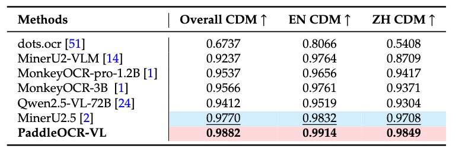
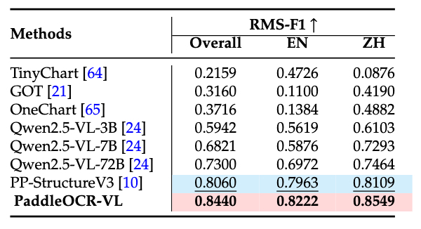

<div align="center">


<h1 align="center">

PaddleOCR-VL: Boosting Multilingual Document Parsing via a 0.9B Ultra-Compact Vision-Language Model

</h1>

[](https://github.com/mindspore-lab/mindnlp)
[![HuggingFace](https://img.shields.io/badge/HuggingFace-black.svg?logo=data:image/png;base64,iVBORw0KGgoAAAANSUhEUgAAAF8AAABYCAMAAACkl9t/AAAAk1BMVEVHcEz/nQv/nQv/nQr/nQv/nQr/nQv/nQv/nQr/wRf/txT/pg7/yRr/rBD/zRz/ngv/oAz/zhz/nwv/txT/ngv/0B3+zBz/nQv/0h7/wxn/vRb/thXkuiT/rxH/pxD/ogzcqyf/nQvTlSz/czCxky7/SjifdjT/Mj3+Mj3wMj15aTnDNz+DSD9RTUBsP0FRO0Q6O0WyIxEIAAAAGHRSTlMADB8zSWF3krDDw8TJ1NbX5efv8ff9/fxKDJ9uAAAGKklEQVR42u2Z63qjOAyGC4RwCOfB2JAGqrSb2WnTw/1f3UaWcSGYNKTdf/P+mOkTrE+yJBulvfvLT2A5ruenaVHyIks33npl/6C4s/ZLAM45SOi/1FtZPyFur1OYofBX3w7d54Bxm+E8db+nDr12ttmESZ4zludJEG5S7TO72YPlKZFyE+YCYUJTBZsMiNS5Sd7NlDmKM2Eg2JQg8awbglfqgbhArjxkS7dgp2RH6hc9AMLdZYUtZN5DJr4molC8BfKrEkPKEnEVjLbgW1fLy77ZVOJagoIcLIl+IxaQZGjiX597HopF5CkaXVMDO9Pyix3AFV3kw4lQLCbHuMovz8FallbcQIJ5Ta0vks9RnolbCK84BtjKRS5uA43hYoZcOBGIG2Epbv6CvFVQ8m8loh66WNySsnN7htL58LNp+NXT8/PhXiBXPMjLSxtwp8W9f/1AngRierBkA+kk/IpUSOeKByzn8y3kAAAfh//0oXgV4roHm/kz4E2z//zRc3/lgwBzbM2mJxQEa5pqgX7d1L0htrhx7LKxOZlKbwcAWyEOWqYSI8YPtgDQVjpB5nvaHaSnBaQSD6hweDi8PosxD6/PT09YY3xQA7LTCTKfYX+QHpA0GCcqmEHvr/cyfKQTEuwgbs2kPxJEB0iNjfJcCTPyocx+A0griHSmADiC91oNGVwJ69RudYe65vJmoqfpul0lrqXadW0jFKH5BKwAeCq+Den7s+3zfRJzA61/Uj/9H/VzLKTx9jFPPdXeeP+L7WEvDLAKAIoF8bPTKT0+TM7W8ePj3Rz/Yn3kOAp2f1Kf0Weony7pn/cPydvhQYV+eFOfmOu7VB/ViPe34/EN3RFHY/yRuT8ddCtMPH/McBAT5s+vRde/gf2c/sPsjLK+m5IBQF5tO+h2tTlBGnP6693JdsvofjOPnnEHkh2TnV/X1fBl9S5zrwuwF8NFrAVJVwCAPTe8gaJlomqlp0pv4Pjn98tJ/t/fL++6unpR1YGC2n/KCoa0tTLoKiEeUPDl94nj+5/Tv3/eT5vBQ60X1S0oZr+IWRR8Ldhu7AlLjPISlJcO9vrFotky9SpzDequlwEir5beYAc0R7D9KS1DXva0jhYRDXoExPdc6yw5GShkZXe9QdO/uOvHofxjrV/TNS6iMJS+4TcSTgk9n5agJdBQbB//IfF/HpvPt3Tbi7b6I6K0R72p6ajryEJrENW2bbeVUGjfgoals4L443c7BEE4mJO2SpbRngxQrAKRudRzGQ8jVOL2qDVjjI8K1gc3TIJ5KiFZ1q+gdsARPB4NQS4AjwVSt72DSoXNyOWUrU5mQ9nRYyjp89Xo7oRI6Bga9QNT1mQ/ptaJq5T/7WcgAZywR/XlPGAUDdet3LE+qS0TI+g+aJU8MIqjo0Kx8Ly+maxLjJmjQ18rA0YCkxLQbUZP1WqdmyQGJLUm7VnQFqodmXSqmRrdVpqdzk5LvmvgtEcW8PMGdaS23EOWyDVbACZzUJPaqMbjDxpA3Qrgl0AikimGDbqmyT8P8NOYiqrldF8rX+YN7TopX4UoHuSCYY7cgX4gHwclQKl1zhx0THf+tCAUValzjI7Wg9EhptrkIcfIJjA94evOn8B2eHaVzvBrnl2ig0So6hvPaz0IGcOvTHvUIlE2+prqAxLSQxZlU2stql1NqCCLdIiIN/i1DBEHUoElM9dBravbiAnKqgpi4IBkw+utSPIoBijDXJipSVV7MpOEJUAc5Qmm3BnUN+w3hteEieYKfRZSIUcXKMVf0u5wD4EwsUNVvZOtUT7A2GkffHjByWpHqvRBYrTV72a6j8zZ6W0DTE86Hn04bmyWX3Ri9WH7ZU6Q7h+ZHo0nHUAcsQvVhXRDZHChwiyi/hnPuOsSEF6Exk3o6Y9DT1eZ+6cASXk2Y9k+6EOQMDGm6WBK10wOQJCBwren86cPPWUcRAnTVjGcU1LBgs9FURiX/e6479yZcLwCBmTxiawEwrOcleuu12t3tbLv/N4RLYIBhYexm7Fcn4OJcn0+zc+s8/VfPeddZHAGN6TT8eGczHdR/Gts1/MzDkThr23zqrVfAMFT33Nx1RJsx1k5zuWILLnG/vsH+Fv5D4NTVcp1Gzo8AAAAAElFTkSuQmCC&labelColor=white)](https://huggingface.co/lvyufeng/PaddleOCR-VL-0.9B)

[](./LICENSE)

**📝 arXiv**: [Technical Report](https://arxiv.org/pdf/2510.14528)

</div>

<div align="center">

</div>

## Introduction

**PaddleOCR-VL** is a SOTA and resource-efficient model tailored for document parsing. Its core component is PaddleOCR-VL-0.9B, a compact yet powerful vision-language model (VLM) that integrates a NaViT-style dynamic resolution visual encoder with the ERNIE-4.5-0.3B language model to enable accurate element recognition. This innovative model efficiently supports 109 languages and excels in recognizing complex elements (e.g., text, tables, formulas, and charts), while maintaining minimal resource consumption. Through comprehensive evaluations on widely used public benchmarks and in-house benchmarks, PaddleOCR-VL achieves SOTA performance in both page-level document parsing and element-level recognition. It significantly outperforms existing solutions, exhibits strong competitiveness against top-tier VLMs, and delivers fast inference speeds. These strengths make it highly suitable for practical deployment in real-world scenarios.

### **Core Features**

1. **Compact yet Powerful VLM Architecture:** We present a novel vision-language model that is specifically designed for resource-efficient inference, achieving outstanding performance in element recognition. By integrating a NaViT-style dynamic high-resolution visual encoder with the lightweight ERNIE-4.5-0.3B language model, we significantly enhance the model’s recognition capabilities and decoding efficiency. This integration maintains high accuracy while reducing computational demands, making it well-suited for efficient and practical document processing applications.


2. **SOTA Performance on Document Parsing:** PaddleOCR-VL achieves state-of-the-art performance in both page-level document parsing and element-level recognition. It significantly outperforms existing pipeline-based solutions and exhibiting strong competitiveness against leading vision-language models (VLMs) in document parsing. Moreover, it excels in recognizing complex document elements, such as text, tables, formulas, and charts, making it suitable for a wide range of challenging content types, including handwritten text and historical documents. This makes it highly versatile and suitable for a wide range of document types and scenarios.


3. **Multilingual Support:** PaddleOCR-VL Supports 109 languages, covering major global languages, including but not limited to Chinese, English, Japanese, Latin, and Korean, as well as languages with different scripts and structures, such as Russian (Cyrillic script), Arabic, Hindi (Devanagari script), and Thai. This broad language coverage substantially enhances the applicability of our system to multilingual and globalized document processing scenarios.


### **Model Architecture** 

<!-- PaddleOCR-VL decomposes the complex task of document parsing into a two stages. The first stage, PP-DocLayoutV2, is responsible for layout analysis, where it localizes semantic regions and predicts their reading order. Subsequently, the second stage, PaddleOCR-VL-0.9B, leverages these layout predictions to perform fine-grained recognition of diverse content, including text, tables, formulas, and charts. Finally, a lightweight post-processing module aggregates the outputs from both stages and formats the final document into structured Markdown and JSON. -->

<div align="center">

</div>


## News 
* ```2025.10.19``` 🚀 MindNLP support [PaddleOCR-VL](https://github.com/PaddlePaddle/PaddleOCR), — a multilingual documents parsing via a 0.9B Ultra-Compact Vision-Language Model with SOTA performance.


## MindSpore Usage    

### Install Dependencies

Install [MindNLP](https://github.com/mindspore-lab/mindnlp)

```bash
pip install mindspore==2.7.0
pip install mindnlp==0.5.0rc3
```


### Basic Usage

```python
import mindspore
import mindnlp
from transformers import AutoModel, AutoProcessor, AutoTokenizer
from transformers.image_utils import load_image


model = AutoModel.from_pretrained("lvyufeng/PaddleOCR-VL-0.9B", trust_remote_code=True, dtype=mindspore.float16, device_map='auto')
tokenizer = AutoTokenizer.from_pretrained("lvyufeng/PaddleOCR-VL-0.9B")
processor = AutoProcessor.from_pretrained("lvyufeng/PaddleOCR-VL-0.9B", trust_remote_code=True)

image = load_image(
    "https://hf-mirror.com/datasets/hf-internal-testing/fixtures_got_ocr/resolve/main/image_ocr.jpg"
)

query = 'OCR:'
messages = [
    {
        "role": "user",
        "content": query,
    }
]

text = tokenizer.apply_chat_template(messages, tokenize=False)
inputs = processor(image, text=text, return_tensors="pt", format=True).to('cuda')
generate_ids = model.generate(**inputs, do_sample=False, num_beams=1, max_new_tokens=1024)
print(generate_ids.shape)
decoded_output = processor.decode(
    generate_ids[0], skip_special_tokens=True
)
print(decoded_output)
```

### Prompts

Besides OCR, PaddleOCR-VL also supports various tasks, including: table recognition, chart recognition and formula recognition.
You can replace the prompt with the following usages:

```python
query = "OCR:"
query = "Table Recognition:"
query = "Chart Recognition:"
query = "Formula Recognition:"
```

## Pytorch Usage

You can also use use PaddleOCR-VL with Pytorch.

### Install Dependencies

```bash
pip install torch
pip install transformers==4.57.1
```


### Basic Usage

```python
import torch
from transformers import AutoModel, AutoProcessor, AutoTokenizer
from transformers.image_utils import load_image


model = AutoModel.from_pretrained("lvyufeng/PaddleOCR-VL-0.9B", trust_remote_code=True, dtype=torch.bfloat16, device_map='auto')
tokenizer = AutoTokenizer.from_pretrained("lvyufeng/PaddleOCR-VL-0.9B")
processor = AutoProcessor.from_pretrained("lvyufeng/PaddleOCR-VL-0.9B", trust_remote_code=True)

image = load_image(
    "https://hf-mirror.com/datasets/hf-internal-testing/fixtures_got_ocr/resolve/main/image_ocr.jpg"
)

query = 'OCR:'
messages = [
    {
        "role": "user",
        "content": query,
    }
]

text = tokenizer.apply_chat_template(messages, tokenize=False)
inputs = processor(image, text=text, return_tensors="pt", format=True).to('cuda')
generate_ids = model.generate(**inputs, do_sample=False, num_beams=1, max_new_tokens=1024)
print(generate_ids.shape)
decoded_output = processor.decode(
    generate_ids[0], skip_special_tokens=True
)
print(decoded_output)
```

## Performance

### Page-Level Document Parsing 


#### 1. OmniDocBench v1.5

##### PaddleOCR-VL achieves SOTA performance for overall, text, formula, tables and reading order on OmniDocBench v1.5

<div align="center">

</div>


####  2. OmniDocBench v1.0

##### PaddleOCR-VL achieves SOTA performance for almost all metrics of overall, text, formula, tables and reading order on OmniDocBench v1.0


<div align="center">

</div>


> **Notes:** 
> - The metrics are from [MinerU](https://github.com/opendatalab/MinerU), [OmniDocBench](https://github.com/opendatalab/OmniDocBench), and our own internal evaluations.


### Element-level Recognition  

#### 1. Text

**Comparison of OmniDocBench-OCR-block Performance**

PaddleOCR-VL’s robust and versatile capability in handling diverse document types, establishing it as the leading method in the OmniDocBench-OCR-block performance evaluation. 

<div align="center">

</div>


**Comparison of In-house-OCR Performance**

In-house-OCR provides a evaluation of performance across multiple languages and text types. Our model demonstrates outstanding accuracy with the lowest edit distances in all evaluated scripts.

<div align="center">

</div>


#### 2. Table

**Comparison of In-house-Table Performance**

Our self-built evaluation set contains diverse types of table images, such as Chinese, English, mixed Chinese-English, and tables with various characteristics like full, partial, or no borders, book/manual formats, lists, academic papers, merged cells, as well as low-quality, watermarked, etc. PaddleOCR-VL achieves remarkable performance across all categories.

<div align="center">

</div>

#### 3. Formula

**Comparison of In-house-Formula Performance**

In-house-Formula evaluation set contains simple prints, complex prints, camera scans, and handwritten formulas. PaddleOCR-VL demonstrates the best performance in every category.

<div align="center">

</div>


#### 4. Chart

**Comparison of In-house-Chart Performance**

The evaluation set is broadly categorized into 11 chart categories, including bar-line hybrid, pie, 100% stacked bar, area, bar, bubble, histogram, line, scatterplot, stacked area, and stacked bar. PaddleOCR-VL not only outperforms expert OCR VLMs but also surpasses some 72B-level multimodal language models.

<div align="center">

</div>


## Visualization


### Comprehensive Document Parsing

<div align="center">


</div>


### Text

<div align="center">


</div>


### Table

<div align="center">


</div>


### Formula

<div align="center">


</div>


### Chart

<div align="center">
  
  
</div>


## Acknowledgments

We would like to thank [ERNIE](https://github.com/PaddlePaddle/ERNIE), [Keye](https://github.com/Kwai-Keye/Keye), [MinerU](https://github.com/opendatalab/MinerU), [OmniDocBench](https://github.com/opendatalab/OmniDocBench) for providing valuable code, model weights and benchmarks. We also appreciate everyone's contribution to this open-source project!

## Citation

If you find PaddleOCR-VL helpful, feel free to give us a star and citation.

```bibtex
@misc{paddleocrvl2025technicalreport,
      title={PaddleOCR-VL: Boosting Multilingual Document Parsing via a 0.9B Ultra-Compact Vision-Language Model},
      author={Cui, C. et al.},
      year={2025},
      primaryClass={cs.CL},
      howpublished={\url{https://ernie.baidu.com/blog/publication/PaddleOCR-VL_Technical_Report.pdf}}
}
```